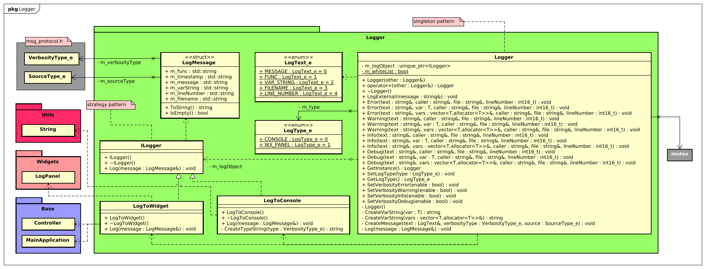
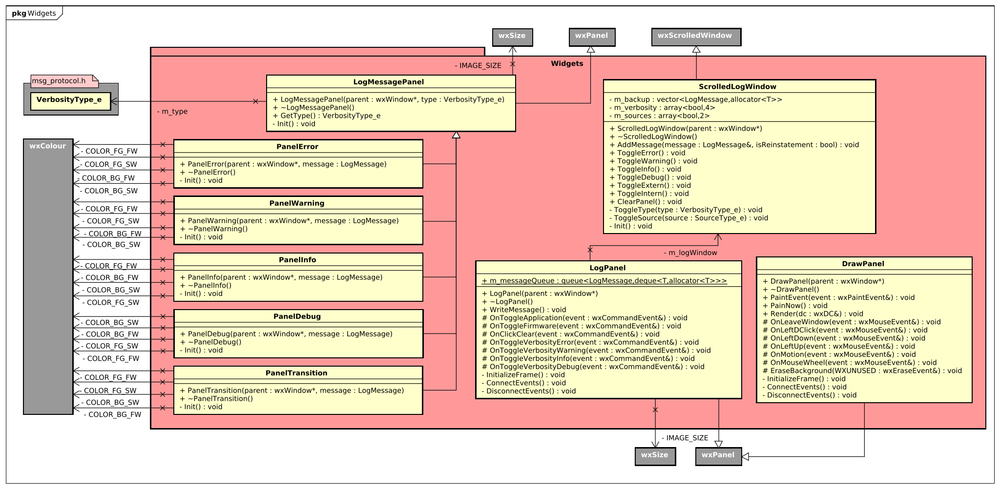

# Robox application

This page contains the software application for the ROBOX project. The software application uses the libraries wxWidgets & boost.

The messaging protocol used in this project can be found [here](https://github.com/LukevLuijn/robox_docs/blob/main/protocol/protocol_description.pdf).

The Interface description can be found [here]()


For the full documentation go to [this page](https://github.com/LukevLuijn/robox_docs). All documentation is written in dutch.

## Installation instructions

```bash
# From the root of the project folder.

$ mkdir build
$ cd build
$ cmake ..
$ make
$ ./robox
```

## Class diagrams

||
|:---:|
||
| **Diagram 1** - *Design class diagram*|
||
| **Diagram 1** - *Package Base*|
||
| **Diagram 1** - *Package Driver*|
||
| **Diagram 1** - *Package Frame*|
||
| **Diagram 1** - *Package Logger*|
||
| **Diagram 1** - *Package Utils*|
||
| **Diagram 1** - *Package Widgets*|