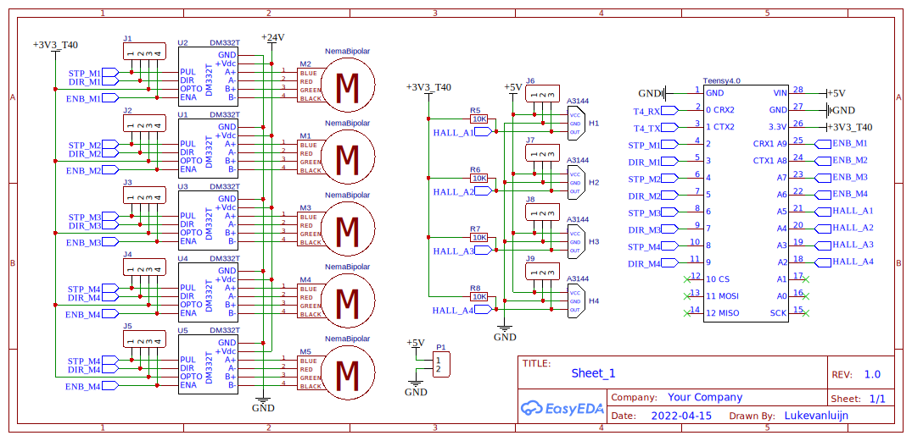
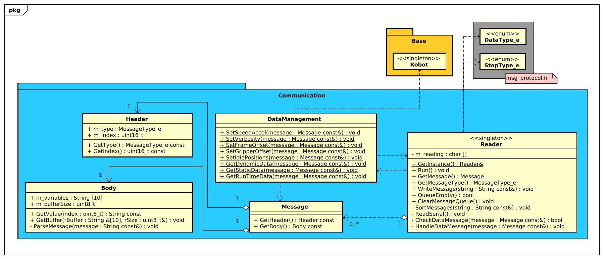
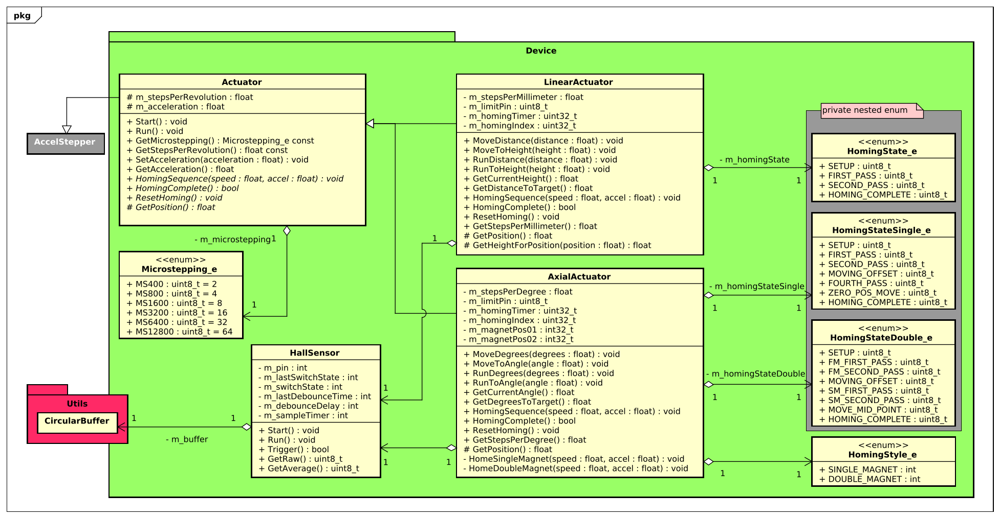
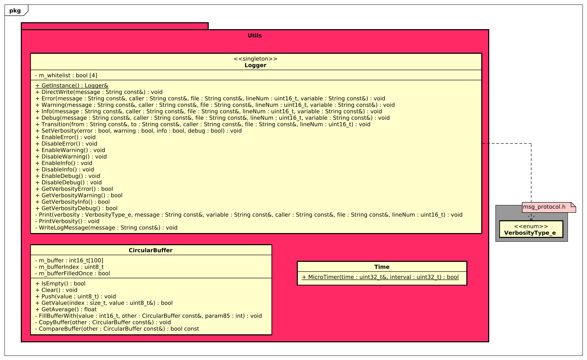

# Robox firmware

This page contains the firmware for the ROBOX project. The firmware is produced to be run on a Teensy 4.0, it uses no external libraries.

## Wiring diagram

||
|:---:|
||
| **Image 1** - *Schematic*|

## Class diagrams

||
|:---:|
||
| **Diagram 1** - *Design class diagram*|
||
| **Diagram 2** - *Package Base*|
||
| **Diagram 3** - *Package Communication*|
||
| **Diagram 4** - *Package Device*|
||
| **Diagram 5** - *Package StateMachine*|
||
| **Diagram 6** - *Package Utils*|

