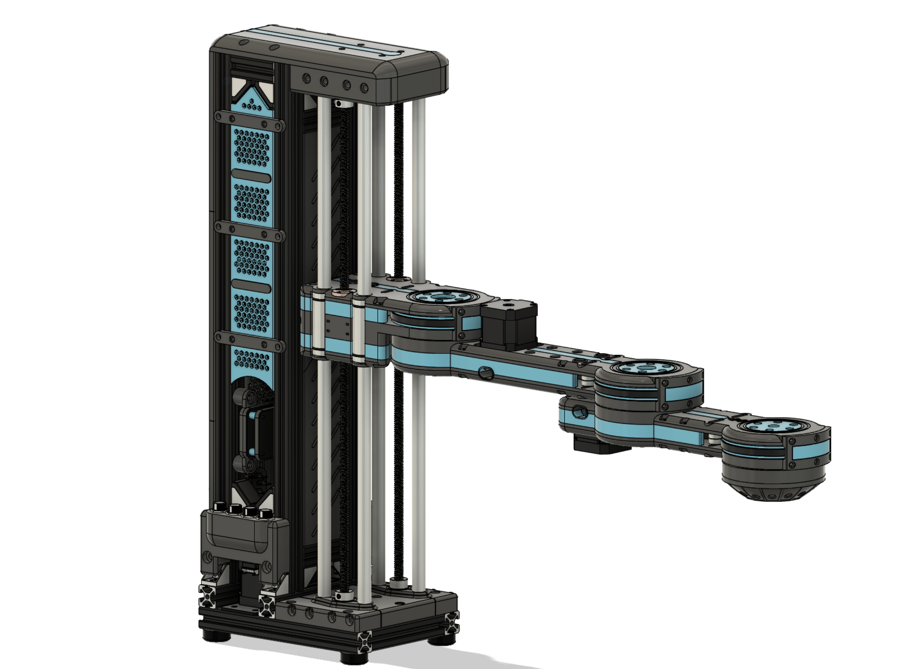
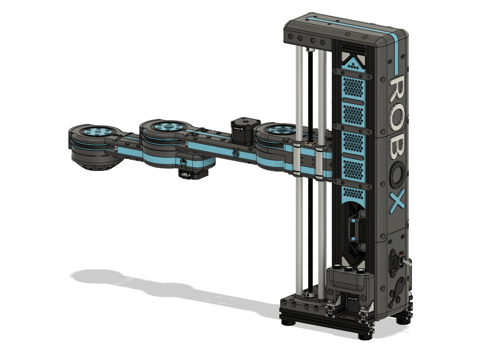
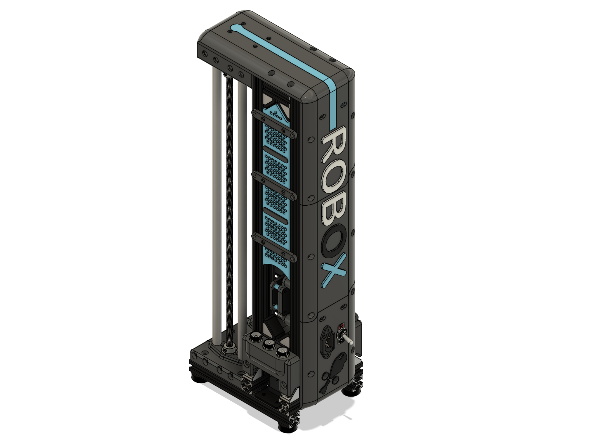
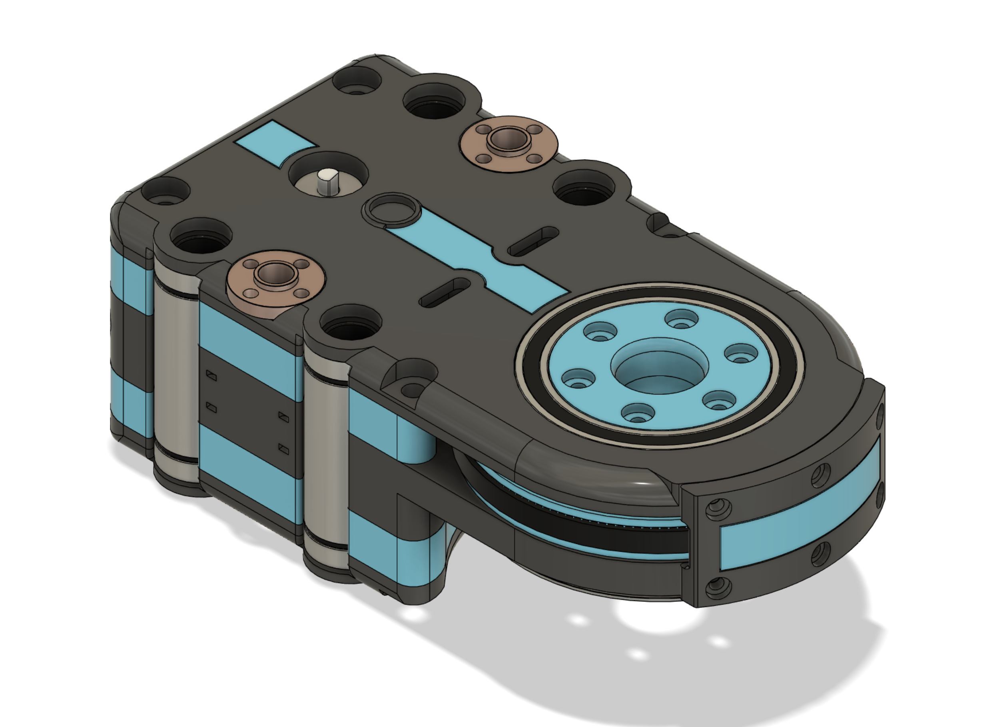
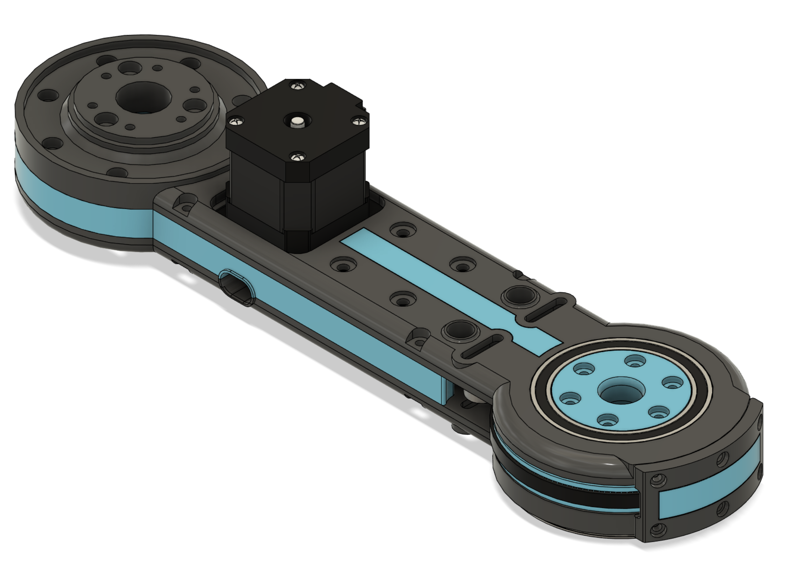
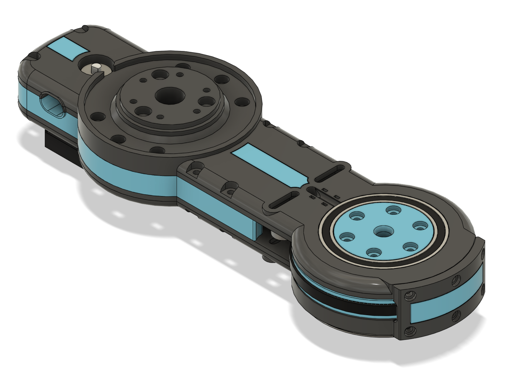
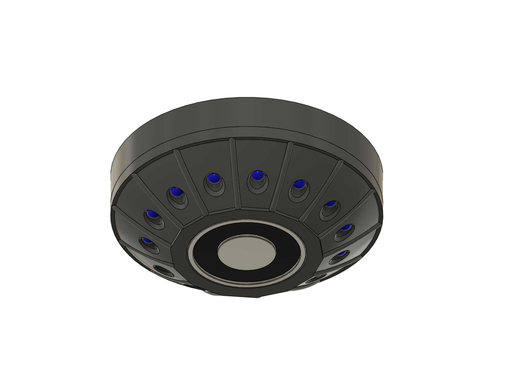

# ROBOX Models

## Robox assembly

|||
|:--:|:---:|
|||
|**!image** - *Assembly front view*|**!image** - *Assembly back view*|

## Segments

||
|:---:|
||
|**!image** - *Segment 00*|

||
|:---:|
||
|**!image** - *Segment 01*|

||
|:---:|
||
|**!image** - *Segment 02*|

||
|:---:|
||
|**!image** - *Segment 03*|

||
|:---:|
||
|**!image** - *Gripper Electromagnet*|

