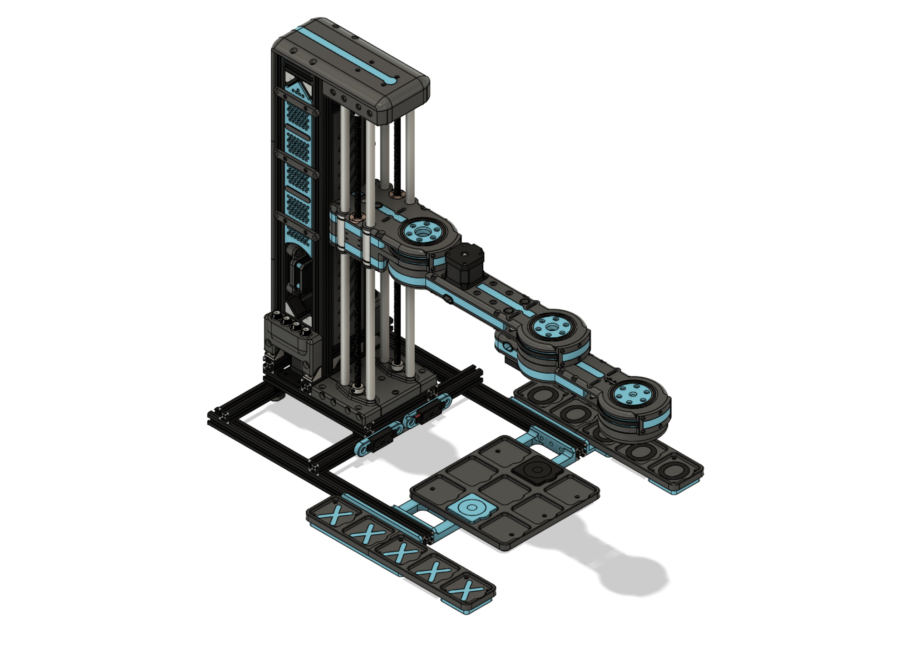
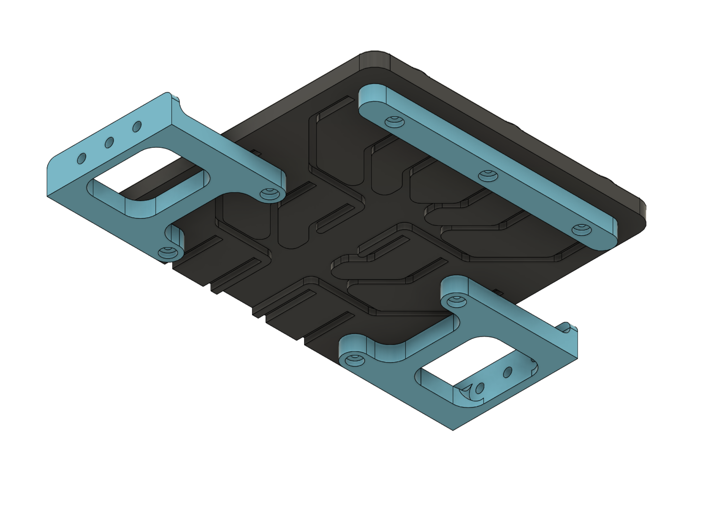
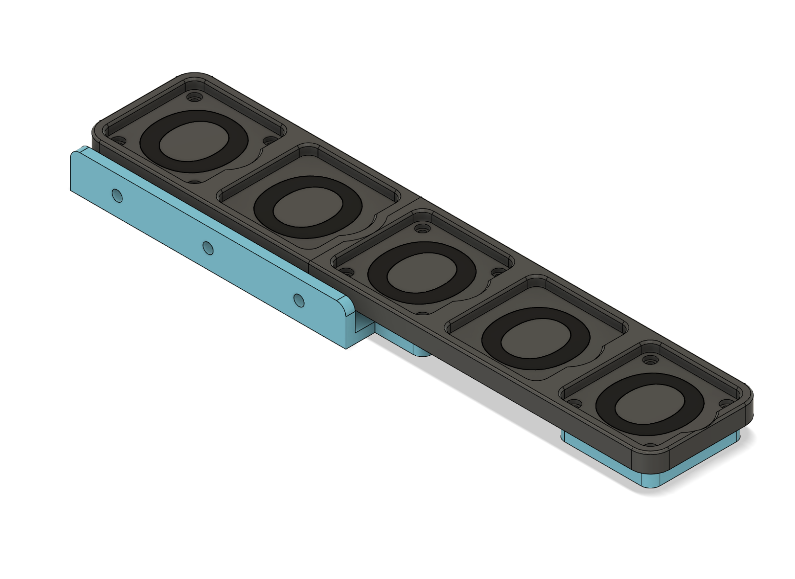

# ROBOX Models

This directory contains all .stl files needed to print your own ROBOX.

## Robox assembly

|||
|:--:|:---:|
|||
|**Image 1** - *Assembly front view*|**Image 2** - *Assembly back view*|

## Segments

|||
|:---:|:---:|
|||
|**Image 3** - *Segment 00*|**Image 4** - *Segment 01*|
|||
|**Image 5** - *Segment 02*|**Image 6** - *Segment 03*|

# BKE

|||
|:--:|:---:|
|||
|**Image 7** - *BKE assembly 01*|**Image 8** - *BKE assembly 02*|

## Board

|||
|:--:|:---:|
|||
|**Image 9** - *Board - top*|**Image 10** - *Board - bot*|

## Storage

|||||
|:---:|:---:|:---:|:---:|
|||||
|**Image 11** - *Storage X - top*|**Image 12** - *Storage X - bot*|**Image 13** - *Storage O - top*|**Image 14** - *Storage O - bot*|

## Pieces

|||||
|:---:|:---:|:---:|:---:|
|||||
|**Image 15** - *Piece X - top*|**Image 16** - *Piece X - bot*|**Image 17** - *Piece O - top*|**Image 18** - *Piece O - bot*|
